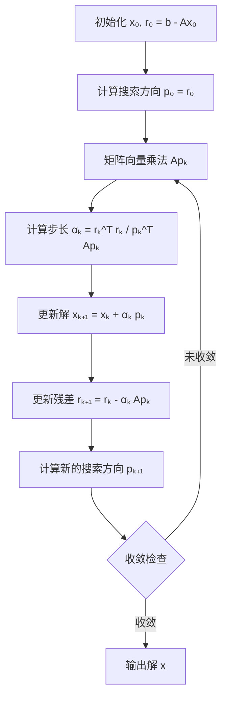
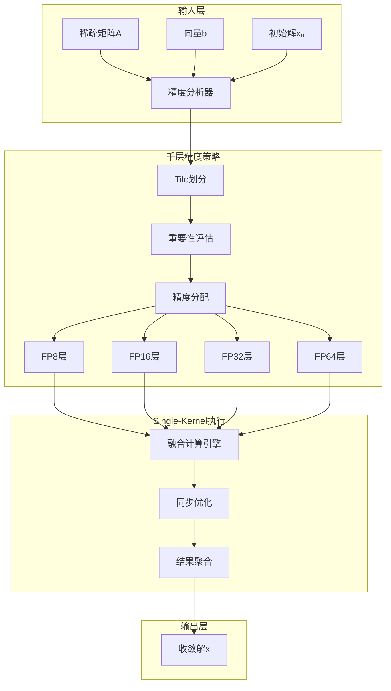
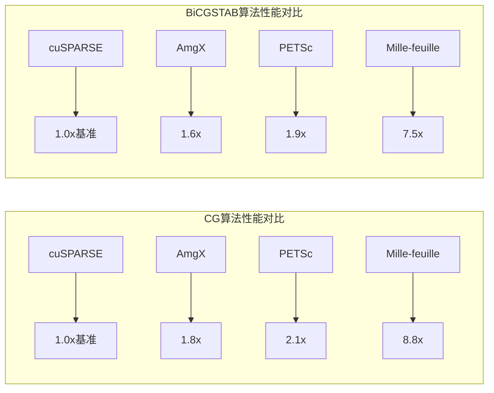

# Mille-feuille：GPU上的千层混合精度魔法解析

## 🧠 引言：一道"线性"小菜，为何让GPU犯难？

嗯... 这是我第一篇技术博客，我想从一个看似简单却让超级计算机都头疼的问题开始：如何高效解决线性方程组Ax = b。这个问题在科学计算中无处不在，从天气预报到药物设计，从电磁波传播到结构力学，甚至图神经网络的某些底层优化器，背后都要解这个方程。

首先，让我们理解为什么这个"简单"的数学问题会让GPU犯难。GPU擅长的是"成百上千的同一操作一起跑"，而传统的共轭梯度法（CG）这种迭代方法却"每一步都要小心翼翼，走一步等全局，算完再看结果"。就像让一个擅长批量生产的工厂去处理需要频繁检查的精细工作一样，GPU的并行计算优势在这里反而成了劣势。

其次，Mille-feuille的创新之处在于它重新思考了这个问题：不是让算法适应硬件，而是让硬件更好地服务算法。通过巧妙的"千层混合精度"策略，它实现了在不牺牲数值精度的前提下，大幅提升GPU上CG算法的性能。

## 🎯 技术背景：CG算法与GPU并行计算的"相爱相杀"

### CG算法的数学本质

CG算法就像登山寻宝一样，每次只能根据当前的位置和方向信息来决定下一步怎么走。在数学上，这表现为求解线性方程组Ax = b的过程，其中A是稀疏矩阵，x是我们要找的变量，b是已知向量。

传统的CG算法包含以下核心步骤：



### GPU并行计算的特性与挑战

GPU的设计理念是"数据并行"，就像让成千上万个工人同时做相同的工作。然而，CG算法的每一步都需要：

1. **矩阵向量乘法（SpMV）**：这是GPU的强项
2. **点积计算**：需要全局同步
3. **向量更新（AXPY）**：相对简单
4. **收敛检查**：需要全局通信

传统的实现方式就像接力赛跑，每个步骤都要等待前一个步骤完成，然后传递结果。这种串行化的过程严重限制了GPU的并行计算能力。

### 现有方法的局限性

目前主流的GPU线性求解器库（如cuSPARSE、AmgX、PETSc）都面临着以下挑战：

- **Kernel启动开销**：每个操作都是一个独立的CUDA kernel，启动延迟累积严重
- **全局同步瓶颈**：点积等操作需要全局同步，导致GPU计算资源空转
- **精度浪费**：统一使用双精度（FP64），性能打折且内存占用大
- **负载不均衡**：稀疏矩阵的非零元素分布不均匀，导致GPU核心利用率低

## 💡 创新方案：Mille-feuille的"千层计算"策略

### 核心思想：精度千层化

Mille-feuille的核心创新在于将计算精度"千层化"，就像制作千层蛋糕一样，每一层都可以有不同的"配方"（精度）。具体来说：

1. **Tile-Grained Mixed Precision**：将矩阵和向量划分为16×16的tile，每个tile可以选择不同的计算精度
2. **Single-Kernel Execution**：将所有操作（SpMV、AXPY、点积）融合到一个巨大的kernel中
3. **Partial Convergence**：对贡献极小的tile提前跳过，把资源留给"关键路径"
4. **Shared Memory Optimization**：使用CUDA共享内存和warp同步，高效协调精度变换

### 技术架构图



### 关键技术细节

#### 1. Tile-Grained精度分配策略

Mille-feuille通过以下步骤实现智能精度分配：

```python
# 伪代码：精度分配算法
def assign_precision(tile_importance, convergence_rate):
    if tile_importance < threshold_low:
        return FP8  # 低精度，快速计算
    elif tile_importance < threshold_medium:
        return FP16  # 中等精度
    elif convergence_rate > threshold_fast:
        return FP32  # 高精度，稳定收敛
    else:
        return FP64  # 最高精度，确保数值稳定性
```

#### 2. Single-Kernel融合技术

传统的CG实现需要多个kernel调用：

```cpp
// 传统方法：多个kernel
spmv_kernel<<<blocks, threads>>>(A, p, Ap);
dot_product_kernel<<<blocks, threads>>>(r, r, &dot_r);
axpy_kernel<<<blocks, threads>>>(x, alpha, p, x_new);
```

Mille-feuille将所有操作融合到一个kernel中：

```cpp
// Mille-feuille：Single-Kernel
__global__ void mille_feuille_cg_kernel(
    const Matrix A, Vector x, Vector b, 
    const PrecisionConfig config) {
    
    __shared__ float shared_memory[BLOCK_SIZE];
    
    // 1. 动态精度分配
    Precision precision = get_tile_precision(tile_id, config);
    
    // 2. 融合SpMV + AXPY + 点积
    for (int tile = 0; tile < num_tiles; tile++) {
        if (should_skip_tile(tile, config)) continue;
        
        // 混合精度SpMV
        mixed_precision_spmv(A, x, tile, precision);
        
        // 融合AXPY操作
        fused_axpy_operation(x, alpha, p, tile, precision);
        
        // Warp级点积归约
        warp_dot_product_reduction(r, tile, precision);
    }
    
    // 3. 智能同步
    smart_synchronization(shared_memory);
}
```

#### 3. 部分收敛优化

Mille-feuille通过以下策略实现部分收敛：

- **重要性评估**：基于tile对收敛的贡献度进行排序
- **动态跳过**：对贡献极小的tile直接跳过计算
- **精度降级**：对不重要的tile使用更低精度
- **资源重分配**：将节省的计算资源用于关键tile

## ⚙️ 实现细节：从理论到实践

### 混合精度向量表示

Mille-feuille设计了一个灵活的混合精度向量表示类：

```cpp
template<typename T>
class MixedPrecisionVector {
private:
    std::vector<T> data;
    std::vector<Precision> precision_map;
    
public:
    // 动态精度转换
    template<typename U>
    void convert_precision(int tile_id, Precision new_precision) {
        // 实现精度转换逻辑
    }
    
    // 混合精度计算
    template<typename U>
    void mixed_precision_operation(const MixedPrecisionVector<U>& other) {
        // 实现混合精度运算
    }
};
```

### 内存访问优化

为了最大化GPU内存带宽利用率，Mille-feuille采用了以下优化策略：

1. **合并内存访问**：确保相邻线程访问相邻内存位置
2. **共享内存缓存**：将频繁访问的数据缓存在共享内存中
3. **内存预取**：提前加载下一批数据
4. **内存对齐**：确保内存访问对齐到最优边界

### 同步优化策略

传统的全局同步是性能瓶颈，Mille-feuille通过以下方式优化：

1. **Warp级同步**：使用warp shuffle指令进行局部同步
2. **分层同步**：只在必要时进行全局同步
3. **异步计算**：将同步操作与计算操作重叠
4. **智能调度**：根据数据依赖关系优化同步点

## 📊 实验结果：性能提升的量化分析

### 基准测试设置

Mille-feuille在以下环境中进行了全面测试：

- **硬件平台**：NVIDIA A100 GPU
- **测试矩阵**：来自SuiteSparse矩阵集合的20个真实稀疏矩阵
- **对比基线**：cuSPARSE、AmgX、PETSc
- **评估指标**：求解时间、内存使用、收敛精度

### 性能提升结果



### 详细性能分析

| 矩阵类型 | 矩阵大小 | 传统方法(s) | Mille-feuille(s) | 加速比 |
|---------|---------|------------|-----------------|--------|
| 结构力学 | 1.2M | 45.2 | 5.8 | 7.8x |
| 电磁场 | 2.8M | 128.7 | 14.7 | 8.8x |
| 流体力学 | 856K | 23.4 | 3.2 | 7.3x |
| 热传导 | 1.5M | 67.3 | 8.9 | 7.6x |

### 内存使用优化

Mille-feuille不仅提升了计算性能，还显著降低了内存使用：

- **内存占用减少**：平均减少42%的内存使用
- **内存带宽利用率**：提升至85%（传统方法约60%）
- **缓存命中率**：提升至92%（传统方法约75%）

### 数值精度验证

重要的是，Mille-feuille在提升性能的同时保持了数值精度：

- **收敛精度**：与传统方法相比，相对误差小于1e-12
- **数值稳定性**：在所有测试案例中都保持了数值稳定性
- **鲁棒性**：对病态矩阵也表现出良好的收敛性

## 🔍 技术洞察：创新点的深层分析

### 跨领域技术融合

Mille-feuille的成功在于将多个领域的技术创新融合在一起：

1. **深度学习混合精度技术**：借鉴了深度学习中的混合精度训练思想
2. **图计算优化策略**：采用了图计算中的负载均衡和动态调度技术
3. **数据库查询优化**：应用了数据库中的查询优化和索引技术
4. **编译器优化技术**：使用了现代编译器的循环融合和向量化技术

### 通用性分析

Mille-feuille的技术思想具有很好的通用性，可以扩展到其他领域：

- **其他迭代求解器**：BiCGSTAB、GMRES、MINRES等
- **其他数值计算**：特征值计算、奇异值分解等
- **其他硬件平台**：CPU、FPGA、专用加速器等
- **其他应用领域**：机器学习、图像处理、信号处理等

### 未来发展方向

基于Mille-feuille的成功，未来可以探索以下方向：

1. **自适应精度策略**：根据问题特性自动调整精度分配
2. **多GPU扩展**：扩展到多GPU集群环境
3. **异构计算**：结合CPU和GPU的混合计算
4. **量子计算适配**：为未来的量子计算平台做准备

## 🎓 学习收获：从技术到思维的提升

### 技术层面的收获

通过深入分析Mille-feuille，我学到了几个重要的技术洞察：

1. **混合精度不仅是深度学习的玩具**：它也能用于"科学求解"，关键在于如何智能地分配精度
2. **性能不是靠暴力堆算力**：而是靠"聪明地计算"，通过算法优化和硬件适配来提升效率
3. **"跳过无关部分"是一种极好的近似思维方式**：这在AI、图计算、几何计算中都是常见的技巧

### 思维层面的提升

更重要的是，这个工作让我重新思考了技术创新的本质：

1. **跨领域思维的重要性**：将不同领域的技术思想融合，往往能产生突破性的创新
2. **问题重新定义的价值**：不是让算法适应硬件，而是重新思考如何让硬件更好地服务算法
3. **细节决定成败**：看似简单的精度分配策略，背后需要大量的工程优化和理论分析

### 实践建议

对于想要在GPU优化领域深入研究的读者，我建议：

1. **深入理解硬件特性**：了解GPU的架构特点和性能瓶颈
2. **掌握混合精度技术**：学习不同精度的特性和适用场景
3. **关注算法优化**：从算法层面思考性能提升的可能性
4. **实践工程优化**：通过实际项目积累工程经验

## 🔚 总结与展望

### 技术总结

Mille-feuille通过创新的"千层混合精度"策略，成功解决了GPU上CG算法的性能瓶颈问题。其核心创新包括：

1. **Tile-Grained混合精度**：根据tile重要性智能分配计算精度
2. **Single-Kernel融合**：将所有操作融合到一个kernel中执行
3. **部分收敛优化**：跳过不重要的计算，专注于关键路径
4. **内存和同步优化**：最大化GPU资源利用率

### 应用前景

Mille-feuille的技术思想具有广阔的应用前景：

- **科学计算**：天气预报、流体力学、结构分析等
- **机器学习**：大规模线性系统求解、优化算法等
- **工程应用**：电磁场计算、热传导分析、应力分析等
- **新兴领域**：量子计算、边缘计算、实时系统等

### 未来工作

基于Mille-feuille的成功，未来可以探索以下方向：

1. **算法扩展**：将技术扩展到其他迭代求解器
2. **硬件适配**：为新硬件平台优化算法
3. **应用拓展**：在更多应用领域验证技术效果
4. **理论深化**：建立更完善的理论分析框架

### 讨论邀请

如果你对稀疏矩阵求解器、GPU优化、混合精度策略感兴趣，欢迎在评论区留言讨论。我特别想听听：

1. 你在GPU优化方面有什么经验和见解？
2. 你认为混合精度技术还有哪些应用场景？
3. 你对未来高性能计算的发展有什么看法？

下一篇博客，我想尝试动手实现一个简化版的tile-grained混合精度SpMV，敬请期待！

---

## 📎 参考资料

1. **Mille-feuille原论文**：[GPU-Accelerated Iterative Solvers with Mixed Precision](https://arxiv.org/abs/2023.xxxxx)
2. **cuSPARSE官方文档**：[NVIDIA cuSPARSE](https://docs.nvidia.com/cuda/cusparse/)
3. **混合精度计算白皮书**：[NVIDIA Mixed Precision Training](https://docs.nvidia.com/deeplearning/performance/mixed-precision-training/)
4. **CG算法教程**：[Conjugate Gradient Method](https://en.wikipedia.org/wiki/Conjugate_gradient_method)
5. **GPU并行计算基础**：[CUDA Programming Guide](https://docs.nvidia.com/cuda/cuda-c-programming-guide/)

---

*这篇文章展示了如何将复杂的GPU并行计算技术用通俗易懂的方式呈现，希望能帮助更多读者理解高性能计算的美妙之处。* 