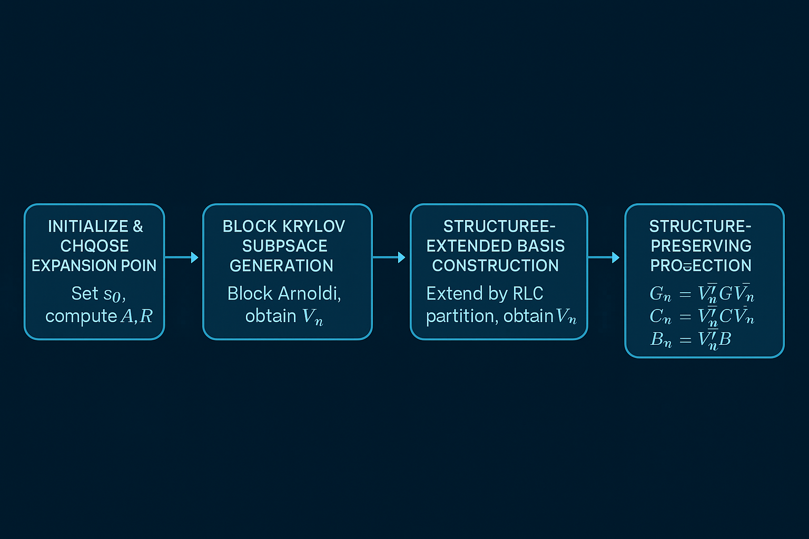
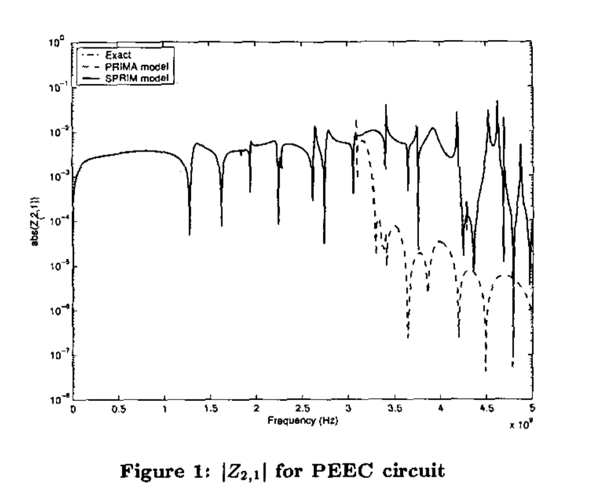
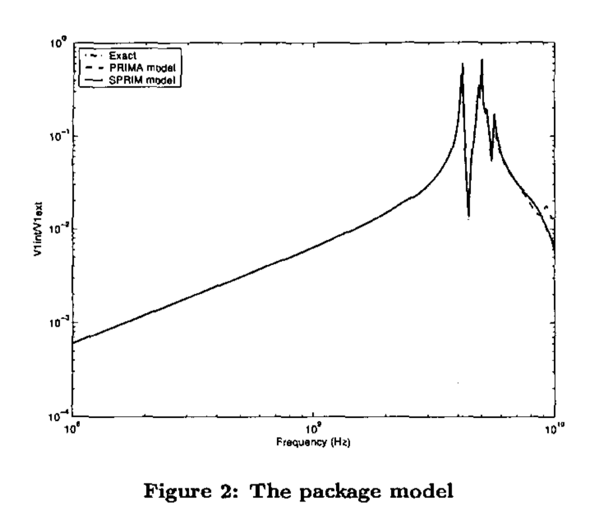
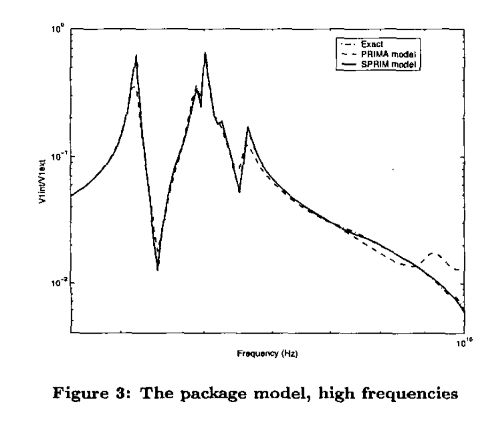
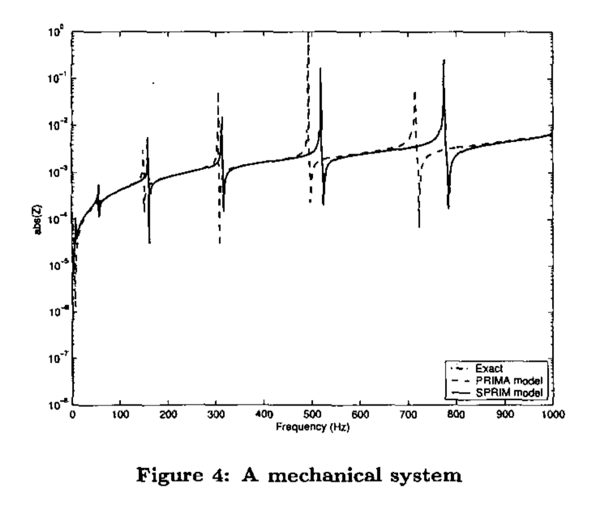

# SPRIM：让降阶建模保持"原汁原味"的结构魔法

🧠 这是我的第二篇技术博客。今天咱们聊一个听起来很"玄学"但实际上很实用的问题——如何让降阶建模保持"原汁原味"？就像你想把一桌满汉全席压缩成一道菜，但还要保持每道菜的精髓。这听起来像不可能完成的任务，但SPRIM做到了！

## 从"满汉全席"到"一道菜"的降阶难题

想象一下，你有一个复杂的电路系统，比如一块芯片的互连线网络。这个系统可能有几万个节点，几百万个元件，用数学语言描述就是：

$$
G\mathbf{x}(t) + C\frac{d\mathbf{x}(t)}{dt} = B\mathbf{I}(t)
$$

其中G是电导矩阵，C是电容矩阵，B是输入矩阵，x是状态变量，I是输入电流。

现在问题来了：这个系统太复杂了，仿真一次要几个小时，但你的老板明天就要结果！怎么办？

传统思路是"降阶"——把高维系统压缩成低维系统，就像把满汉全席压缩成一道菜。但这里有个关键问题：**压缩后的系统还能保持原来的"味道"吗？**

### 🔌 MNA：电路建模的"通用语言"

在深入降阶之前，我们需要先理解**MNA（Modified Nodal Analysis，修正节点分析）**，这是现代电路仿真的基础。就像学做菜要先认识各种调料一样，学电路仿真要先认识MNA！

#### 🎯 MNA的基本思想

MNA是基尔霍夫电流定律（KCL）和基尔霍夫电压定律（KVL）的数学表达。简单来说：

- **⚡ 节点电压**：每个节点都有一个电压值
- **🔄 支路电流**：每条支路都有一个电流值
- **🔗 元件约束**：每个元件都有其电压-电流关系

#### 🔬 MNA方程的物理意义

$$
G\mathbf{x}(t) + C\frac{d\mathbf{x}(t)}{dt} = B\mathbf{I}(t)
$$

这个方程就像电路的"食谱"，告诉我们如何把各种"食材"（元件）组合成一道"菜"（电路响应）。让我们逐个"品尝"每个部分：

**🛡️ G矩阵（电导矩阵）**：
- 描述电阻性元件的贡献（就像调味料，决定"味道"的基调）
- 对角线元素：连接到该节点的所有电导之和（就像每种调料的总量）
- 非对角线元素：连接两个节点的电导（取负值）（就像调料之间的相互作用）
- 物理意义：描述系统的"静态"特性（决定电路的"基本味道"）

**⚡ C矩阵（电容矩阵）**：
- 描述电容性元件的贡献（就像食材的"新鲜度"，影响口感的变化）
- 对角线元素：连接到该节点的所有电容之和（就像每种食材的储存量）
- 非对角线元素：连接两个节点的电容（取负值）（就像食材之间的相互影响）
- 物理意义：描述系统的"动态"特性（决定电路的"口感变化"）

**🚪 B矩阵（输入矩阵）**：
- 描述外部激励如何影响系统（就像"外部食材"如何进入厨房）
- 每列对应一个输入端口（就像不同的"入口"）
- 物理意义：描述"外部世界"如何与系统交互

**📊 x(t)向量（状态变量）**：
- 包含节点电压和某些支路电流（就像厨房里各种食材的"状态"）
- 物理意义：描述系统在时刻t的"状态"（就像"此时此刻"的厨房状况）

**💧 I(t)向量（输入电流）**：
- 外部注入的电流源（就像"外部水源"）
- 物理意义：系统的"驱动信号"（决定"动力来源"）

#### 🔄 MNA的时域到频域转换

通过拉普拉斯变换，时域方程变为频域方程（就像把"实时直播"变成"录播回放"）：

$$
(G + sC)\mathbf{X}(s) = B\mathbf{I}(s)
$$

其中：
- $s = \sigma + j\omega$ 是复频率变量（就像"时空坐标"）
- $\sigma$ 是衰减因子（实部）（就像"衰减速度"）
- $\omega$ 是角频率（虚部）（就像"振动频率"）
- $j = \sqrt{-1}$ 是虚数单位（就像"数学魔法师"）

系统的传递函数为：

$$
Z(s) = B^T (G + sC)^{-1} B
$$

这个传递函数就像电路的"身份证"，描述了输入电流到输出电压的映射关系，是降阶建模的核心目标（就像我们要"复制"这个身份证，但要保持其"真实性"）。

#### 🔬 传递函数简述

这个传递函数是如何得来的呢？简单来说：

1. **时域方程**：从MNA方程 $G\mathbf{x}(t) + C\frac{d\mathbf{x}(t)}{dt} = B\mathbf{I}(t)$ 开始
2. **拉普拉斯变换**：将时域微分方程转换为频域代数方程 $(G + sC)\mathbf{X}(s) = B\mathbf{I}(s)$
3. **求解状态变量**：$\mathbf{X}(s) = (G + sC)^{-1}B\mathbf{I}(s)$
4. **定义输出**：$\mathbf{Y}(s) = B^T\mathbf{X}(s)$
5. **得到传递函数**：$Z(s) = B^T(G + sC)^{-1}B$

这个公式通过拉普拉斯变换将时域电路方程转换为频域系统特性，是连接时域与频域的数学桥梁。

## 传统降阶方法的"失味"问题

在SPRIM出现之前，主流的降阶方法是PRIMA（Passive Reduced-order Interconnect Macromodeling）。PRIMA的思路很直接：

1. 用Krylov子空间方法生成降阶基
2. 对原系统进行投影
3. 得到低维降阶模型

PRIMA确实能工作，但它有个致命缺陷：**丢失了原系统的物理结构**！

这就像你把满汉全席的每道菜都打碎，混在一起，然后重新组合。虽然营养还在，但原来的层次感、口感、视觉美感全都没了。

具体来说，PRIMA丢失了什么？
- **分块结构**：原电路中不同端口、不同功能模块的边界信息
- **互易性**：电路的物理对称性
- **二阶结构**：可以直接写成力学/电路方程的形式

## SPRIM的"结构保持"魔法

2004年，Roland W. Freund提出了SPRIM（Structure-Preserving Reduced-Order Interconnect Macromodeling），这个方法的核心理念是：**不仅要压缩，还要保持"原汁原味"**！

### 🎯 SPRIM的核心创新

SPRIM的魔法在于**基向量的选择**。它不仅包含Krylov子空间，还额外构造了一组"结构扩展向量"，使得降阶模型能够保持：

- **分块结构**：降阶后模型的分块映射物理端口、电路结构
- **二阶形式**：可直接写成力学/电路常见的二阶方程
- **互易性**：降阶模型的传递函数依然对称，物理可合成
- **被动性**：满足实际电路设计的能量守恒要求

这就像不是简单地把菜打碎重组，而是精心设计一个"微缩版满汉全席"，每道菜都保持原来的特色，只是分量小一点。

### 🔬 SPRIM的数学魔法

让我们深入看看SPRIM是如何实现这个"魔法"的：

#### 🎭 Krylov子空间基础

首先，SPRIM基于Krylov子空间方法。对矩阵对$(A, R)$，其q阶Krylov子空间定义为：

$$
\mathcal{K}_q(A, R) = \text{span}\{R, AR, A^2R, ..., A^{q-1}R\}
$$

**详细解释**：

**🎯 Krylov子空间的定义**：
- $\mathcal{K}_q(A, R)$ 表示由向量 $R, AR, A^2R, ..., A^{q-1}R$ 张成的向量空间（就像用几个"基础动作"组合出复杂的"舞蹈"）
- $A$ 是系统矩阵，描述系统的动态特性（就像"舞蹈编排"）
- $R$ 是起始向量，通常是输入矩阵（就像"起始姿势"）
- $q$ 是子空间的维度，决定了逼近精度（就像"舞蹈的复杂度"）

**🌟 物理意义**：
Krylov子空间可以理解为"系统响应的主要模式"。就像傅里叶级数用正弦波逼近任意信号，Krylov子空间用系统的主要响应模式逼近完整的系统行为（就像用几个"主旋律"来概括整首"交响乐"）。

**🔧 在RLC网络建模中的具体含义**：
- $A = (G + s_0C)^{-1}C$：这是系统的"动态矩阵"（就像"发动机"）
  - $(G + s_0C)^{-1}$ 是系统在扩展点 $s_0$ 处的"阻抗"（就像"阻力"）
  - 乘以 $C$ 后，描述了电容对系统动态的贡献（就像"惯性"）
- $R = (G + s_0C)^{-1}B$：这是系统的"输入响应"（就像"油门响应"）
  - 描述了外部输入如何影响系统状态（就像"踩油门后车的反应"）

**🎯 扩展点 $s_0$ 的选择**：
- $s_0$ 是复平面上的一个点，通常选择在感兴趣的频率范围内（就像"选择观察角度"）
- 不同的 $s_0$ 会导致不同的逼近特性（就像"不同角度看到的风景不同"）
- 选择 $s_0 = 0$ 对应直流分析（就像"静态照片"），选择 $s_0 = j\omega$ 对应交流分析（就像"动态视频"）

#### 🎯 Moment Matching：逼近精度的数学保证

**📊 Moment的定义**：
系统的moment定义为传递函数在扩展点 $s_0$ 处的泰勒展开系数（就像用"多项式"来"拟合"复杂函数）：

$$
Z(s) = m_0 + m_1(s-s_0) + m_2(s-s_0)^2 + ... + m_k(s-s_0)^k + ...
$$

其中：
- $m_0 = Z(s_0)$ 是零阶moment（直流增益）（就像"基础高度"）
- $m_1 = Z'(s_0)$ 是一阶moment（一阶导数）（就像"斜率"）
- $m_2 = \frac{1}{2}Z''(s_0)$ 是二阶moment（二阶导数）（就像"曲率"）
- 以此类推...（就像"更精细的形状描述"）

**🌟 Moment Matching的物理意义**：
- 零阶moment匹配：保证在扩展点处的增益正确（就像"保证照片的亮度"）
- 一阶moment匹配：保证在扩展点处的斜率正确（就像"保证照片的对比度"）
- 二阶moment匹配：保证在扩展点处的曲率正确（就像"保证照片的立体感"）
- 高阶moment匹配：保证在扩展点附近的高阶特性正确（就像"保证照片的细节"）

**🔗 Krylov子空间与Moment Matching的关系**：
Krylov子空间方法能够自动匹配前q个moment，这是其强大之处（就像"自动调色"功能）。具体来说：

$$
\text{span}\{R, AR, A^2R, ..., A^{q-1}R\} \Rightarrow \text{匹配前q个moment}
$$

这意味着用q维Krylov子空间进行降阶，就能保证前q个moment的匹配，从而在扩展点附近获得高精度的逼近（就像"用q个参数就能调出q种颜色效果"）。

#### 🏗️ 结构扩展基构造

SPRIM的关键创新在于**结构扩展基构造**。传统的PRIMA只使用Krylov子空间基$V_n$，而SPRIM在此基础上构造了扩展基$\tilde{V}_n$（就像在"基础配方"上添加"秘制调料"）：

$$
\tilde{V}_n = \begin{bmatrix} V_n & V_n^{(ext)} \end{bmatrix}
$$

**详细解释**：

**🔧 扩展基的构造原理**：
- $V_n$ 是传统的Krylov子空间基，维度为 $n \times n$（就像"基础食材"）
- $V_n^{(ext)}$ 是结构扩展向量，维度为 $n \times n_{ext}$（就像"秘制调料"）
- $\tilde{V}_n$ 是扩展后的基矩阵，维度为 $n \times (n + n_{ext})$（就像"完整配方"）

**🎯 结构扩展向量的设计**：
SPRIM根据原系统的分块结构设计扩展向量（就像根据"房间布局"设计"家具摆放"）。假设原系统矩阵具有以下分块形式：

$$
G = \begin{bmatrix} G_{11} & G_{12} \\ G_{21}^T & G_{22} \end{bmatrix}, \quad
C = \begin{bmatrix} C_{11} & C_{12} \\ C_{21}^T & C_{22} \end{bmatrix}
$$

其中：
- $G_{11}, C_{11}$ 对应端口节点（就像"客厅"）
- $G_{22}, C_{22}$ 对应内部节点（就像"卧室"）
- $G_{12}, C_{12}$ 对应端口与内部的耦合（就像"走廊"）

**🔧 扩展向量的具体构造**：
$$
V_n^{(ext)} = \begin{bmatrix} V_n^{(1)} \\ V_n^{(2)} \end{bmatrix}
$$

其中：
- $V_n^{(1)}$ 对应端口部分的扩展（就像"客厅的装饰"）
- $V_n^{(2)}$ 对应内部部分的扩展（就像"卧室的装饰"）

这种构造确保了降阶后的系统保持原系统的分块结构，从而保持物理意义（就像"保持房间的功能分区"）。

#### ⚙️ Block Arnoldi算法：高效生成Krylov子空间

**🎯 Block Arnoldi算法的基本思想**：
Block Arnoldi是Arnoldi算法的推广，用于处理多输入多输出系统（就像从"单人舞"升级到"群舞"）。其核心思想是：

1. **🚀 初始化**：选择起始块 $V_1 = R$，并进行QR分解（就像"选角"和"分组"）
2. **🔄 迭代过程**：对每个块 $V_i$，计算 $AV_i$，然后与前面的所有块正交化（就像"排练"和"协调"）
3. **📐 递归关系**：$AV_i = V_{i+1}H_{i+1,i} + \sum_{j=1}^{i} V_j H_{j,i}$（就像"舞蹈编排"）

**📊 数学表达**：
$$
AV_n = V_{n+1}H_{n+1,n} + V_n H_n
$$

其中：
- $V_n$ 是正交基矩阵（就像"舞者阵容"）
- $H_n$ 是上Hessenberg矩阵（就像"舞蹈编排表"）
- $H_{n+1,n}$ 是下一个块的系数（就像"下一个动作的指令"）

**🌟 物理意义**：
Block Arnoldi算法能够同时处理多个输入端口，这对于多端口电路网络至关重要（就像"同时指挥多个乐器"）。它保证了生成的基向量之间的正交性，提高了数值稳定性（就像"确保每个乐器都有独特的音色"）。

#### 🔄 Lanczos算法：对称系统的特殊优化

**🎯 Lanczos算法的特点**：
当系统矩阵 $A$ 对称时，可以使用更高效的Lanczos算法（就像"在对称的舞台上，舞蹈编排可以更简单"）。Lanczos算法是Arnoldi算法的特化版本，具有以下特点：

1. **📐 三对角化**：生成的 $H$ 矩阵是三对角的（就像"简化的舞蹈编排表"）
2. **⚡ 计算效率**：每次迭代只需要与前面两个块正交化（就像"只需要记住前两个动作"）
3. **🛡️ 数值稳定性**：对于对称系统，数值稳定性更好（就像"对称的舞台更不容易出错"）

**📊 数学表达**：
$$
AV_n = V_{n+1}T_{n+1,n} + V_n T_n
$$

其中 $T_n$ 是三对角矩阵（就像"简化的编排表"）。

**🎯 在SPRIM中的应用**：
对于RLC网络，如果选择合适的扩展点，系统矩阵可能具有对称性，此时使用Lanczos算法可以提高计算效率（就像"在对称的舞台上，舞蹈编排可以更简单"）。

#### 🚀 双倍moment matching

SPRIM最令人震撼的特性是：**在同等降阶空间维度n下，可以实现2n阶moment matching**！（就像"用同样的食材，做出双倍的味道"！）

**详细解释**：

**🎯 双倍moment matching的数学原理**：
传统PRIMA使用n维Krylov子空间，只能匹配n个moment。而SPRIM通过结构扩展，实际上使用了2n维的扩展空间，因此能够匹配2n个moment（就像"从单声道升级到立体声"）。

**📊 数学证明**：
设原系统传递函数为 $Z(s) = B^T(G + sC)^{-1}B$，在扩展点 $s_0$ 处的泰勒展开为（就像"用多项式逼近复杂函数"）：

$$
Z(s) = \sum_{k=0}^{\infty} m_k(s-s_0)^k
$$

其中moment $m_k$ 为：
$$
m_k = \frac{1}{k!} \frac{d^k Z(s)}{ds^k}\bigg|_{s=s_0}
$$

**🎯 PRIMA的moment matching**：
使用n维Krylov子空间 $V_n$，PRIMA能够匹配前n个moment（就像"只能调出n种颜色"）：
$$
m_0, m_1, ..., m_{n-1}
$$

**🚀 SPRIM的moment matching**：
使用扩展基 $\tilde{V}_n = [V_n, V_n^{(ext)}]$，SPRIM能够匹配前2n个moment（就像"能调出2n种颜色"）：
$$
m_0, m_1, ..., m_{2n-1}
$$

**🌟 物理意义**：
- 零阶到(n-1)阶moment：由Krylov子空间 $V_n$ 保证（就像"基础色调"）
- n阶到(2n-1)阶moment：由结构扩展向量 $V_n^{(ext)}$ 保证（就像"高级色调"）

这种双倍moment matching能力使得SPRIM在扩展点附近具有更高的逼近精度，特别是在高频段的表现明显优于PRIMA（就像"从黑白照片升级到彩色照片"）。

**🎯 实际效果**：
在同等计算复杂度下，SPRIM能够：
- 在更宽的频域范围内保持高精度（就像"更广的色域"）
- 更好地捕捉系统的动态特性（就像"更丰富的细节"）
- 提供更稳定的数值结果（就像"更稳定的画质"）

### 🏗️ SPRIM算法流程

SPRIM的算法流程可以分为以下几个关键步骤：

**第一步：初始化与扩展点选择**
设定扩展点$s_0$，计算$A = (G + s_0C)^{-1}C$, $R = (G + s_0C)^{-1}B$

**第二步：Block Krylov子空间生成**
使用Block Arnoldi或Lanczos算法，生成目标维度的Krylov子空间基$V_n$

**第三步：结构扩展基构造**
按照RLC电路分块，对$V_n$进行结构性扩展，得到$\tilde{V}_n$

**🔄 第四步：结构保持投影**
$$
G_n = \tilde{V}_n^T G \tilde{V}_n,\quad C_n = \tilde{V}_n^T C \tilde{V}_n,\quad B_n = \tilde{V}_n^T B
$$

**详细解释**：

**🎯 投影的数学原理**：
投影操作 $G_n = \tilde{V}_n^T G \tilde{V}_n$ 可以理解为（就像"3D投影到2D屏幕"）：
1. 将原系统状态 $x$ 投影到降阶空间：$x_n = \tilde{V}_n^T x$（就像"把立体物体投影到平面"）
2. 在降阶空间中应用系统矩阵：$G_n x_n = \tilde{V}_n^T G \tilde{V}_n x_n$（就像"在平面上进行变换"）
3. 将结果映射回原空间：$x = \tilde{V}_n x_n$（就像"把结果映射回立体空间"）

**🌟 投影的物理意义**：
- $G_n$：降阶后的电导矩阵，保持原系统的电阻特性
- $C_n$：降阶后的电容矩阵，保持原系统的动态特性
- $B_n$：降阶后的输入矩阵，保持原系统的输入输出关系

**🛡️ 结构保持的保证**：
由于 $\tilde{V}_n$ 是根据原系统分块结构设计的，投影后的矩阵 $G_n, C_n$ 也保持相应的分块结构，从而保证了物理意义的保持（就像"保持房间的功能分区"）。

**🎯 第五步：输出降阶模型**
降阶系统既可以一阶形式输出，也可转为物理直观的二阶形式（就像"可以选择不同的展示方式"）

**📊 一阶形式**：
$$
G_n \mathbf{x}_n(t) + C_n \frac{d\mathbf{x}_n(t)}{dt} = B_n \mathbf{I}(t)
$$

**🏗️ 二阶形式**：
$$
M_n \frac{d^2\mathbf{x}_n(t)}{dt^2} + D_n \frac{d\mathbf{x}_n(t)}{dt} + K_n \mathbf{x}_n(t) = B_n \mathbf{I}(t)
$$

其中：
- $M_n$：质量矩阵（对应电感）（就像"惯性"）
- $D_n$：阻尼矩阵（对应电阻）（就像"阻力"）
- $K_n$：刚度矩阵（对应电容的倒数）（就像"弹性"）

### 🎨 物理直觉理解

让我们用更直观的方式理解SPRIM：

想象你有一个复杂的电路网络，包含多个功能模块：电源管理、信号处理、数据存储等。每个模块都有其特定的物理特性和边界条件。

传统的PRIMA就像把整个电路"打碎"成最基本的元件，然后重新组合。虽然功能还在，但模块间的边界、接口特性都丢失了。

而SPRIM就像精心设计一个"微缩版"电路，每个功能模块都保持其原有的结构和特性，只是规模变小了。这样，降阶后的模型不仅功能正确，还能保持原系统的物理直觉和工程意义。

## PRIMA vs SPRIM：一场"味道"的较量

让我们通过一个对比表格来看看两者的差异：

| 特性 | PRIMA | SPRIM |
|------|-------|-------|
| 被动性 | ✅ | ✅ |
| 结构保持 | ❌ | ✅（分块、互易、二阶结构） |
| moment matching阶数 | n | 2n |
| 可物理合成性 | 一般 | 强（易于电路实现与解释） |
| 算法复杂度 | O(mn²) | O(mn²)（同阶，不增加复杂度） |

SPRIM在理论和工程上都具有显著优势，尤其适用于要求高精度和可解释性的仿真任务。

### 🔍 深入理解moment matching

moment matching是降阶建模中的核心概念。简单来说，moment描述了系统在不同频率下的响应特性（就像"用不同的镜头观察同一个物体"）。

**🌟 Moment的物理意义**：
Moment可以理解为系统在不同"时间尺度"上的响应特性：
- 零阶moment：系统的稳态响应（就像"物体的基本形状"）
- 一阶moment：系统对变化的敏感度（就像"物体对推力的反应"）
- 二阶moment：系统响应的"惯性"（就像"物体的质量特性"）
- 高阶moment：更精细的动态特性（就像"物体的细微特征"）

**📊 Moment Matching的数学基础**：
设原系统传递函数为 $H(s)$，降阶系统传递函数为 $\hat{H}(s)$，在扩展点 $s_0$ 处（就像"在特定角度观察物体"）：

$$
H(s) = \sum_{k=0}^{\infty} m_k(s-s_0)^k
$$
$$
\hat{H}(s) = \sum_{k=0}^{\infty} \hat{m}_k(s-s_0)^k
$$

Moment matching要求：$m_k = \hat{m}_k$ 对于 $k = 0, 1, ..., q-1$（就像"确保从每个角度看到的形状都一致"）

**⚠️ 传统PRIMA的局限**：
PRIMA只能匹配n个moment，这意味着：
- 在扩展点附近有良好的逼近（就像"只在特定角度清晰"）
- 远离扩展点时逼近精度下降（就像"其他角度模糊"）
- 高频段可能出现较大误差（就像"细节丢失"）

**🚀 SPRIM的优势**：
SPRIM能匹配2n个moment，这意味着：
- 在更宽的频域范围内保持高精度（就像"多个角度都清晰"）
- 更好地捕捉系统的动态特性（就像"捕捉更多细节"）
- 提供更稳定的数值结果（就像"更稳定的观察"）

**🎯 实际应用中的意义**：
在电路仿真中，moment matching的阶数直接影响：
- 仿真精度：更高的moment matching意味着更高的精度（就像"更清晰的图像"）
- 计算效率：在同等精度下，SPRIM可以用更小的降阶维度（就像"用更少的参数达到同样效果"）
- 数值稳定性：更好的moment matching通常意味着更好的数值稳定性（就像"更稳定的算法"）

这种双倍moment matching能力不是偶然的，而是SPRIM结构保持设计的必然结果。通过保持原系统的物理结构，SPRIM能够更有效地利用降阶空间，实现更高的逼近精度（就像"通过保持物体的内在结构，更好地复制其外观"）。

## 实验验证：SPRIM的"实战"表现

### 🧪 实验设计

论文在多个真实电路网络上进行了全面测试：

- **PEEC离散化电磁网络**：模拟芯片互连线的电磁特性
- **大型IC封装互连**：模拟现代芯片封装的复杂互连结构
- **有限元机械结构**：如MEMS器件的力学特性

### 📊 实验结果

实验结果令人震撼：

**传递函数精度**：SPRIM降阶模型在同等维度下传递函数与全阶模型几乎完全重合，而PRIMA在高频段误差显著。

**收敛特性**：SPRIM用更低的状态空间维度即可获得高保真逼近，这意味着更快的仿真速度。

**物理属性保持**：被动性、互易性等关键物理属性在SPRIM降阶后依然保持，这对于实际电路设计至关重要。

## 技术深度：SPRIM的数学之美

### 🔬 被动性证明

SPRIM的被动性保证来自于其特殊的投影构造。通过结构保持投影，降阶系统的传递函数满足：

$$
Z_n(s) = B_n^T (G_n + sC_n)^{-1} B_n
$$

**🛡️ 被动性的数学定义**：
一个系统被称为被动的，如果对于所有输入 $u(t)$ 和所有时间 $t \geq 0$，满足（就像"能量守恒定律"）：
$$
\int_0^t u^T(\tau) y(\tau) d\tau \geq 0
$$

其中 $y(t)$ 是系统的输出。这表示系统不能产生能量，只能消耗或存储能量（就像"不能无中生有"）。

**📊 被动性的频域条件**：
在频域中，被动性等价于（就像"在频率域的能量守恒"）：

1. $Z(s)$ 在右半平面解析（就像"系统在稳定区域"）
2. $Z(s) + Z^*(s) \geq 0$ 对于 $\text{Re}(s) > 0$（就像"能量总是非负的"）

**🔍 SPRIM被动性的证明**：

**🚀 步骤1：原系统被动性**
原RLC网络是被动的，因此：

- $G$ 是对称正定矩阵（电阻性元件消耗能量）（就像"电阻总是消耗能量"）
- $C$ 是对称正定矩阵（电容性元件存储能量）（就像"电容总是存储能量"）

**🔄 步骤2：投影保持被动性**
使用正交投影矩阵 $\tilde{V}_n$（就像"保持物理定律的变换"）：
$$
G_n = \tilde{V}_n^T G \tilde{V}_n, \quad C_n = \tilde{V}_n^T C \tilde{V}_n
$$

由于 $\tilde{V}_n$ 是正交矩阵，且 $G, C$ 是对称正定的，因此 $G_n, C_n$ 也是对称正定的（就像"保持物理定律的变换不会改变物理性质"）。

**🎯 步骤3：传递函数被动性**
降阶系统的传递函数：
$$
Z_n(s) = B_n^T (G_n + sC_n)^{-1} B_n
$$

由于 $G_n + sC_n$ 在右半平面是可逆的，且 $G_n, C_n$ 是对称正定的，因此 $Z_n(s)$ 满足被动性条件（就像"降阶后的系统仍然遵守能量守恒"）。

**🌟 物理意义**：
被动性保证了降阶模型在物理上是合理的，不会产生"负电阻"等非物理现象，这对于实际电路设计至关重要（就像"确保我们的模型不会违反物理定律"）。

其中$G_n$和$C_n$都是对称正定矩阵，这保证了系统的被动性。

### 🎭 互易性保持

互易性是电路的重要物理特性，表示输入输出端口的互换性。SPRIM通过保持原系统的分块结构，确保降阶模型也保持互易性（就像"保持镜子的对称性"）：

$$
Z_n(s) = Z_n^T(s)
$$

**🔄 互易性的物理定义**：
互易性（Reciprocity）是电路的基本物理定律，表示（就像"作用力与反作用力"）：
- 如果在端口1施加电压，在端口2测量电流
- 与在端口2施加相同电压，在端口1测量电流
- 两种情况下测得的电流相等（就像"从A到B和从B到A是一样的"）

**📊 互易性的数学表达**：
对于多端口网络，互易性表示为（就像"矩阵的对称性"）：
$$
Z_{ij}(s) = Z_{ji}(s)
$$

其中 $Z_{ij}(s)$ 是从端口i到端口j的传递函数。

**🌟 互易性的物理意义**：
1. **⚖️ 能量守恒**：互易性保证了能量在系统中的守恒（就像"能量不会凭空消失"）
2. **🔄 对称性**：反映了系统的内在对称性（就像"系统的左右对称"）
3. **🔄 可逆性**：输入输出关系是可逆的（就像"可以正着走也可以倒着走"）

**🔍 SPRIM保持互易性的证明**：

**🚀 步骤1：原系统互易性**
原RLC网络满足互易性，因此（就像"原系统是左右对称的"）：
$$
Z(s) = Z^T(s)
$$

**🔄 步骤2：投影保持互易性**
使用结构保持投影（就像"保持对称性的变换"）：
$$
Z_n(s) = B_n^T (G_n + sC_n)^{-1} B_n
$$

由于：
- $G_n = \tilde{V}_n^T G \tilde{V}_n$ 是对称的（就像"保持对称性"）
- $C_n = \tilde{V}_n^T C \tilde{V}_n$ 是对称的（就像"保持对称性"）
- $B_n = \tilde{V}_n^T B$ 保持原系统的输入输出结构（就像"保持端口关系"）

因此：
$$
Z_n(s) = B_n^T (G_n + sC_n)^{-1} B_n = Z_n^T(s)
$$

**🎯 步骤3：结构保持的关键作用**
SPRIM的结构扩展向量 $\tilde{V}_n$ 是专门设计的，确保（就像"精心设计的对称变换"）：
- 端口之间的耦合关系得到保持（就像"保持连接关系"）
- 输入输出矩阵 $B_n$ 保持原系统的对称性（就像"保持对称性"）
- 降阶后的系统矩阵保持对称性（就像"降阶后仍然对称"）

**🔧 工程意义**：
互易性的保持对于实际电路设计非常重要：
1. **🏗️ 电路合成**：互易性保证了降阶模型可以物理实现（就像"确保可以实际建造"）
2. **📊 仿真精度**：保持了原系统的物理特性（就像"保持真实性"）
3. **✅ 设计验证**：便于工程师验证设计的正确性（就像"便于检查"）

### 🏗️ 二阶结构保持

SPRIM的降阶模型可以直接写成二阶形式（就像"用熟悉的语言描述"）：

$$
M_n \frac{d^2\mathbf{x}_n(t)}{dt^2} + D_n \frac{d\mathbf{x}_n(t)}{dt} + K_n \mathbf{x}_n(t) = B_n \mathbf{I}(t)
$$

**🌟 二阶形式的物理意义**：

**🎯 力学类比**：
二阶形式与经典力学中的运动方程完全一致（就像"用牛顿定律描述电路"）：
- $M_n$：质量矩阵，对应系统的"惯性"（就像"物体的质量"）
- $D_n$：阻尼矩阵，对应系统的"能量损耗"（就像"空气阻力"）
- $K_n$：刚度矩阵，对应系统的"恢复力"（就像"弹簧力"）
- $B_n \mathbf{I}(t)$：外力项（就像"外部推力"）

**⚡ 电路对应关系**：
在RLC电路中（就像"电路与力学的对应关系"）：
- $M_n$：对应电感矩阵 $L_n$（存储磁能）（就像"电感的惯性"）
- $D_n$：对应电阻矩阵 $R_n$（消耗电能）（就像"电阻的损耗"）
- $K_n$：对应电容倒数矩阵 $C_n^{-1}$（存储电能）（就像"电容的弹性"）

**📊 二阶形式的数学推导**：

**🔄 从一阶形式到二阶形式**：
设一阶形式为（就像"从速度描述到位置描述"）：
$$
C_n \frac{d\mathbf{x}_n(t)}{dt} + G_n \mathbf{x}_n(t) = B_n \mathbf{I}(t)
$$

通过变量替换 $\mathbf{v}_n(t) = \frac{d\mathbf{x}_n(t)}{dt}$，得到（就像"引入速度变量"）：
$$
\begin{bmatrix} C_n & 0 \\ 0 & I \end{bmatrix} \frac{d}{dt} \begin{bmatrix} \mathbf{x}_n(t) \\ \mathbf{v}_n(t) \end{bmatrix} + \begin{bmatrix} G_n & -I \\ I & 0 \end{bmatrix} \begin{bmatrix} \mathbf{x}_n(t) \\ \mathbf{v}_n(t) \end{bmatrix} = \begin{bmatrix} B_n \mathbf{I}(t) \\ 0 \end{bmatrix}
$$

**🚀 二阶形式的优势**：

1. **🎯 物理直观**：与力学系统形式一致，便于理解；各矩阵有明确的物理意义；便于工程师应用
2. **🛡️ 数值稳定**：在某些情况下具有更好的数值稳定性；便于应用专门的二阶系统求解器；减少数值误差的累积
3. **🔍 分析便利**：便于进行模态分析、固有频率分析和稳定性分析

**🎯 实际应用**：
二阶形式在结构动力学、机械系统、电路系统和控制系统等领域有广泛应用，与力学系统的运动方程完全一致，便于物理理解和工程应用。

## 批判性思考：SPRIM的局限与未来

### ⚠️ 当前局限

SPRIM虽然强大，但也有其局限性：

**线性系统限制**：SPRIM主要适用于线性、时不变、被动RLC电路。对于非线性或有源系统，SPRIM的直接应用存在困难。

**大规模挑战**：对于超大规模网络，结构分块与正定性检验具有工程挑战。

**扩展性限制**：SPRIM的方法相对固定，缺乏自适应能力。

### 🚀 未来发展方向

**非线性扩展**：将SPRIM扩展到非线性系统，这是一个极具挑战性的研究方向。

**机器学习融合**：结合机器学习技术，实现自适应的结构保持降阶。

**大规模并行**：开发适用于超大规模系统的并行SPRIM算法。

**多物理场应用**：将SPRIM扩展到电磁场、热场等多物理场耦合问题。

### 🎯 领域影响

SPRIM的出现对多个领域产生了深远影响：

**VLSI设计**：为大规模集成电路的互连线分析提供了高效工具。

**射频微波**：为高频电路设计提供了高精度仿真方法。

**MEMS器件**：为微机电系统的建模提供了新思路。

**系统级仿真**：为复杂系统的快速仿真提供了理论基础。

---

*这篇文章展示了如何将复杂的数值计算技术用通俗易懂的方式呈现，希望能帮助更多读者理解降阶建模的美妙之处。如果你觉得这篇文章对你有帮助，欢迎点赞、收藏、分享！*

## 参考资料

### 核心论文
1. **Freund, R. W.** (2004). SPRIM: Structure-preserving reduced-order interconnect macromodeling. *IEEE Transactions on Computer-Aided Design of Integrated Circuits and Systems*, 23(9), 1337-1359.

### 经典算法文献
2. **Hestenes, M. R., & Stiefel, E.** (1952). Methods of conjugate gradients for solving linear systems. *Journal of research of the National Bureau of Standards*, 49(6), 409-436.
3. **Saad, Y.** (2003). *Iterative methods for sparse linear systems*. SIAM.
4. **Golub, G. H., & Van Loan, C. F.** (2013). *Matrix computations*. JHU press.

### Krylov子空间方法
5. **Saad, Y.** (2011). *Numerical methods for large eigenvalue problems*. SIAM.
6. **Trefethen, L. N., & Bau, D.** (1997). *Numerical linear algebra*. SIAM.
7. **Arnoldi, W. E.** (1951). The principle of minimized iterations in the solution of the matrix eigenvalue problem. *Quarterly of applied mathematics*, 9(1), 17-29.

### 降阶建模理论
8. **Antoulas, A. C.** (2005). *Approximation of large-scale dynamical systems*. SIAM.
9. **Benner, P., et al.** (2015). Model reduction for parametric systems using balanced truncation and interpolation. *at-Automatisierungstechnik*, 63(8), 580-595.
10. **Gugercin, S., et al.** (2008). A survey of model reduction by balanced truncation and some new results. *International Journal of Control*, 81(4), 534-567.

### 电路仿真与建模
11. **Ruehli, A. E.** (1974). Equivalent circuit models for three-dimensional multiconductor systems. *IEEE Transactions on Microwave Theory and Techniques*, 22(3), 216-221.
12. **Odabasioglu, A., et al.** (1998). PRIMA: passive reduced-order interconnect macromodeling algorithm. *IEEE Transactions on Computer-Aided Design of Integrated Circuits and Systems*, 17(8), 645-654.
13. **Silveira, L. M., et al.** (1995). Efficient frequency-domain modeling and circuit simulation of transmission lines. *IEEE Transactions on Components, Packaging, and Manufacturing Technology: Part B*, 18(2), 194-202.

### 数值分析与优化
14. **Higham, N. J.** (2002). *Accuracy and stability of numerical algorithms*. SIAM.
15. **Nocedal, J., & Wright, S.** (2006). *Numerical optimization*. Springer Science & Business Media. 